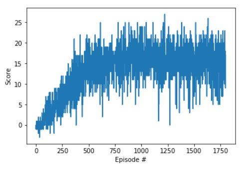

# Report to the Navigation project

This report is written as a part of the Navigation project of the [Deep Reinforcement Learning Udacity Nanodegree Program](https://eu.udacity.com/course/deep-reinforcement-learning-nanodegree--nd893).

## Learning Algorithm

The network is build it with 4 fully connected layers. Each layer has 64 neurons and uses `relu` function.
The following hyperparameters are chosen for training:
```
BUFFER_SIZE = int(1e5)  # replay buffer size
BATCH_SIZE = 64         # minibatch size
GAMMA = 0.99            # discount factor
TAU = 1e-3              # for soft update of target parameters
LR = 5e-4               # learning rate 
UPDATE_EVERY = 4        # how often to update the network
```
During learning phase a fixed Q-target is used that updates every `UPDATE_EVERY` steps.

`model.pth` is a file with the saved model weights of the successful agent.

## Plot of Rewards during learning

The following scores show that 600 episodes are enough to train the network.

```
Episode 100	Average Score: 0.56
Episode 200	Average Score: 3.53
Episode 300	Average Score: 6.28
Episode 400	Average Score: 9.58
Episode 500	Average Score: 13.06
Episode 600	Average Score: 14.47
Episode 700	Average Score: 14.67
Episode 800	Average Score: 15.55
Episode 900	Average Score: 16.17
Episode 1000	Average Score: 16.50
Episode 1100	Average Score: 16.59
Episode 1200	Average Score: 15.70
Episode 1300	Average Score: 16.71
Episode 1400	Average Score: 16.01
```


A plot illustrates that the agent is able to receive an average reward (over 100 episodes) of at least +13. 

## Ideas for Future Work

The following improvements can follow:
1. Now the choice of the action is always needs aome 'eps' value. The upgrate of the function `act` in class `Agent` is required in order to allow `eps=0`.
2. Some improvements like Double DQN, Prioritized Experience Replay and similar can improve the agent's performance.
